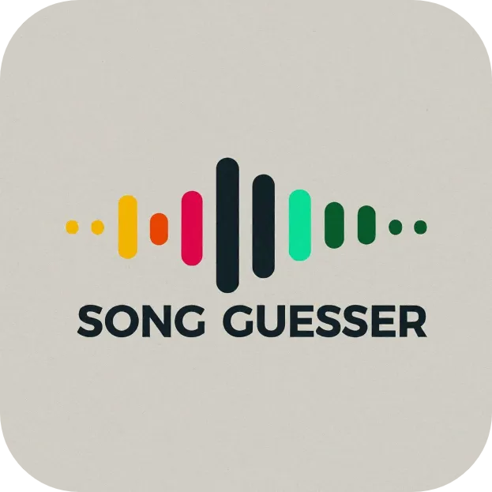

<div align="center" id="top"> 
  

&#xa0;

</div>

<h1 align="center">Song Guesser: Test Your Musical Knowledge!</h1>

<h4 align="center">
    Guess the Song from a Snippet! This engaging music guessing game challenges you to identify songs based on short audio clips. Put your musical knowledge to the test and see how many you can get right!
</h4>

## How to Play

1. Run the Game: Execute `main.py` to launch the application.
2. Start Game: Click the "Start" button on the main menu.
3. Listen and Guess: A random 10-second song fragment will play. You'll be presented with four options showing song titles and albums (if available).
4. Make Your Choice: Select the option you believe matches the played snippet.
5. Check Your Answer: The game will reveal if your guess is correct and update your score.
6. Keep Playing: A new song fragment will automatically play, continuing the fun!

## Features

-   Song Library: The game scans the "music" folder for MP3s, building a library of songs for guessing.
-   Random Snippets: Each round presents a unique 10-second snippet from a random point in the song, ensuring variety and challenge.
-   Multiple Choice: Choose from four options to test your musical recognition skills.
-   Scoring System: Track your progress and see how many songs you correctly guess.
-   Options Menu: Adjust the volume and select a different music folder containing your MP3 files.
-   Download Feature: Easily download songs using the built-in Spotify downloader (requires the spotdl library).

## Code

The project is developed using Python and leverages the following libraries:

-   customtkinter (for the graphical user interface)
-   Pygame (for playing audio)
-   Mutagen (for reading MP3 metadata)
-   Pydub (for audio manipulation)
-   spotdl (for downloading music from Spotify)
-   pillow (for image processing)

The code is organized into several files:

-   `main.py`: The main game logic and user interface.
-   `downloader.py`: Handles the Spotify download functionality.
-   `setup.py`: Creates necessary folders and configuration files.

Feel free to explore the code and contribute to the project!

## Requirements

-   Python 3.x
-   customtkinter
-   Pygame
-   Mutagen
-   Pydub
-   spotdl
-   pillow

Install the required libraries using pip:

```bash
pip install -r requirements.txt
```

## Usage

Clone or download the repository.

Run setup.py once to create necessary folders and configuration files.

Place your MP3 files in the "music" folder.

Run main.py to start the game.

## Additional Notes

-   Ensure your music files are in MP3 format.
-   Adjust the volume using the slider in the options menu.
-   The "Download songs" button opens a separate window for downloading music from Spotify.

## Have Fun!

Challenge yourself and your friends with Song Guesser!
